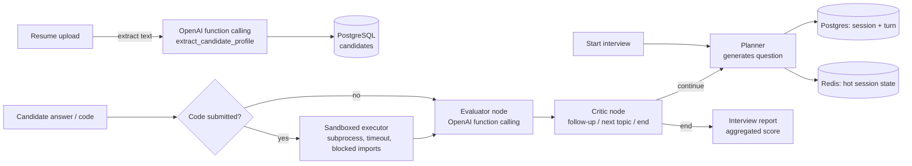

# Agentic AI Interview Assistant

Automates technical interview evaluation end to end: parses a resume,
runs a multi-turn interview with an agentic planner → evaluator → critic
loop, executes candidate-submitted code in a sandbox, and scores every
answer with a structured rubric via OpenAI function calling.

## Architecture



- **Planner** — proposes the next question, adapting to the candidate's
  resume skills and to which prior answers scored poorly.
- **Evaluator** — scores an answer (and code output, if any) against a
  structured rubric (`correctness`, `clarity`, `depth`, `feedback`,
  `follow_up_needed`) using OpenAI **function calling**, not free-text
  parsing — the model is forced to return a schema-valid object.
- **Critic** — reads the evaluation and routes to a follow-up probe on the
  same topic, a fresh topic, or interview completion.
- Planner + Evaluator + Critic are wired together with **LangGraph**
  (`app/interview_graph.py`); the evaluate → critic step is a compiled
  `StateGraph`.
- **Redis** caches the live session state (candidate profile, question
  history, running score) so each turn is a cache read instead of a full
  Postgres history rebuild — this is what lets many concurrent multi-turn
  sessions run without hammering the DB. **Postgres** remains the source of
  truth; if a cache entry expires mid-interview, state rebuilds from
  Postgres transparently (see `_rebuild_state_from_db`).
- **Code execution** runs candidate code in an isolated subprocess with a
  CPU/memory/time limit and a blocked-imports list — see the safety note in
  `app/code_executor.py` for what this is (and isn't) safe for.

## Project layout

```
app/
  main.py              FastAPI app, startup hook
  config.py            Settings (env-driven)
  database.py          Async SQLAlchemy engine/session
  models.py            Candidate / InterviewSession / InterviewTurn
  schemas.py           Pydantic request/response models
  redis_client.py      Session state cache
  resume_parser.py     PDF/DOCX text extraction + OpenAI structured parsing
  code_executor.py      Sandboxed Python execution
  interview_graph.py   LangGraph planner/evaluator/critic
  routers/
    resume.py          POST /resumes/parse
    interview.py        POST /interviews/start, /interviews/{id}/answer, GET /interviews/{id}/report
locustfile.py           Load test (start -> 3 turns -> report, per virtual user)
docker-compose.yml      Postgres + Redis + API
```

## Setup

```bash
cp .env.example .env        # add your OPENAI_API_KEY
docker compose up -d postgres redis
pip install -r requirements.txt
uvicorn app.main:app --reload
```

Tables are auto-created on startup for local development. For anything
beyond a demo, replace `init_models()` with real Alembic migrations.

## API walkthrough

```bash
# 1. Parse a resume
curl -F "file=@resume.pdf" http://localhost:8000/resumes/parse
# -> {"candidate_id": "...", "profile": {...}}

# 2. Start an interview
curl -X POST http://localhost:8000/interviews/start \
  -H "Content-Type: application/json" \
  -d '{"candidate_id": "<id>", "role": "Backend Software Engineer"}'
# -> {"session_id": "...", "question": "...", "question_type": "coding", ...}

# 3. Answer (text or code)
curl -X POST http://localhost:8000/interviews/<session_id>/answer \
  -H "Content-Type: application/json" \
  -d '{"code": "print(sum(range(10)))"}'

# 4. Get the final report
curl http://localhost:8000/interviews/<session_id>/report
```

## Load testing

```bash
locust -f locustfile.py --host http://localhost:8000 \
       --users 120 --spawn-rate 10 --run-time 5m --headless --csv=results
```

Each simulated user runs a full start → 3 answers → report cycle, so 100+
concurrent Locust users approximates 100+ concurrent multi-turn sessions.
Expect OpenAI API latency to dominate the p99, not FastAPI/Redis/Postgres —
size your `--users` and check `results_stats.csv` against your target
throughput/latency numbers.

## Known limitations (be ready to discuss these in an interview)

- Code execution sandbox is subprocess-based with resource limits and a
  blocked-imports list — good for a demo/portfolio, not hardened enough for
  arbitrary untrusted users at scale (would want gVisor/Firecracker or a
  hosted execution API for that).
- `init_models()` auto-creates tables for convenience; a real deployment
  needs Alembic migrations.
- The planner/evaluator prompts are intentionally simple — no retrieval over
  a question bank yet, so questions can occasionally repeat in phrasing.
